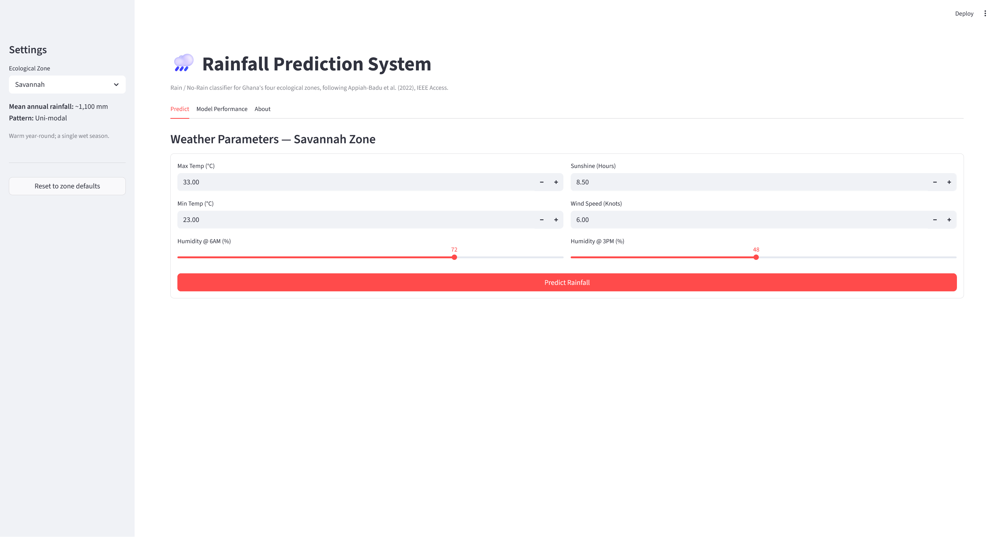
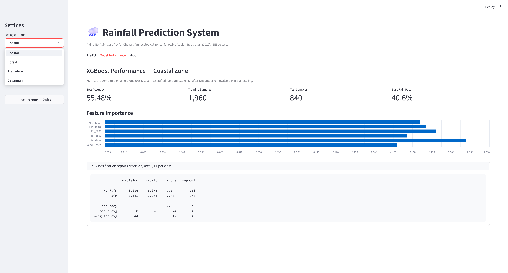
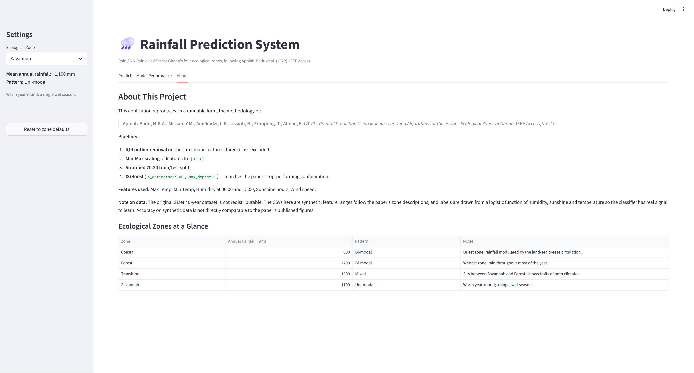

# Rainfall Prediction for Ghana's Ecological Zones
### **Group 6 | Machine Learning Implementation**

## 1. Project Overview
This module reproduces, in a runnable form, the study:

> Appiah-Badu, N.K.A., Missah, Y.M., Amekudzi, L.K., Ussiph, N.,
> Frimpong, T., Ahene, E. (2022). *Rainfall Prediction Using Machine
> Learning Algorithms for the Various Ecological Zones of Ghana.*
> **IEEE Access, Vol. 10.**

It predicts **Rain / No-Rain** from six daily climatic variables across
the four agro-ecological zones of Ghana — **Coastal, Forest, Transition,
Savannah** — using the two top-performing classifiers identified in the
paper: **Random Forest** and **XGBoost**.

## 2. Screenshots

**Predict tab** — enter daily weather parameters and get a Rain / No-Rain
prediction with a confidence score.



**Model Performance tab** — test accuracy, sample counts, feature
importance chart, and per-class precision / recall / F1.



**About tab** — pipeline summary and the four-zone climatology reference.



## 3. Features
Input features (all daily observations):

| Column        | Description                      |
|---------------|----------------------------------|
| `Max_Temp`    | Max temperature (°C)             |
| `Min_Temp`    | Min temperature (°C)             |
| `RH_0600`     | Relative humidity at 06:00 (%)   |
| `RH_1500`     | Relative humidity at 15:00 (%)   |
| `Sunshine`    | Sunshine duration (hours)        |
| `Wind_Speed`  | Wind speed (knots)               |

Target: `Rainfall_Class` — `1` = Rain, `0` = No-Rain.

## 4. Methodology Summary
- **Outlier Removal** — IQR rule on the features only (not the label).
- **Normalization** — Min-Max scaling to `[0, 1]`.
- **Train/Test Split** — 70:30 stratified (80:20 and 90:10 also supported).
- **Models** — Random Forest and XGBoost, both with
  `n_estimators=100`, `max_depth=16` (per the paper, p. 5072).
- **Metrics** — accuracy, precision, recall, F1-score per class.

Full details: see [METHODOLOGY.md](METHODOLOGY.md).

## 5. Installation

Create a virtual environment and install the dependencies:

**Windows (PowerShell):**
```powershell
python -m venv .venv
.\.venv\Scripts\Activate.ps1
pip install pandas numpy scikit-learn xgboost streamlit
```

**macOS / Linux:**
```bash
python3 -m venv .venv
source .venv/bin/activate
pip install pandas numpy scikit-learn xgboost streamlit
```

> **Note (Windows):** if PowerShell blocks `Activate.ps1` with an execution-policy
> error, run PowerShell as Administrator once and execute
> `Set-ExecutionPolicy -Scope CurrentUser RemoteSigned`.

## 6. Usage

> **Important:** Streamlit apps must be launched with `streamlit run`, **not**
> `python app.py`. Running with plain `python` produces "missing
> ScriptRunContext" warnings and no browser window.

### 6.1 Generate sample data (all four zones)
With the virtual environment activated:
```bash
python data_generator.py
```
Creates: `coastal_zone_data.csv`, `forest_zone_data.csv`,
`transition_zone_data.csv`, `savannah_zone_data.csv`.

### 6.2 Launch the web demo
With the virtual environment activated:
```bash
streamlit run app.py
```

If you prefer not to activate the venv, call the binaries directly:

**Windows (PowerShell):**
```powershell
.\.venv\Scripts\python.exe data_generator.py
.\.venv\Scripts\streamlit.exe run app.py
```

**macOS / Linux:**
```bash
./.venv/bin/python data_generator.py
./.venv/bin/streamlit run app.py
```

Select a zone in the sidebar, enter weather parameters, and the trained
XGBoost model will return a Rain / No-Rain prediction with a confidence
score.

### 6.3 Programmatic use
```python
import pandas as pd
from ghana_rainfall import GhanaRainfallPredictor

data = pd.read_csv("forest_zone_data.csv")
predictor = GhanaRainfallPredictor(zone_name="Forest")
clean = predictor.remove_outliers_iqr(data)
X_train, X_test, y_train, y_test = predictor.prepare_and_scale_data(clean)
print(predictor.train_and_test_models(X_train, X_test, y_train, y_test))
```

## 7. Project Structure
```
Group6_Rainfall_Prediction/
├── ghana_rainfall.py   # GhanaRainfallPredictor class (preprocessing + models)
├── data_generator.py   # Synthetic CSVs for all four zones
├── app.py              # Streamlit web UI
├── README.md
├── METHODOLOGY.md      # Detailed paper-to-code mapping
└── docs/               # Screenshots used in README
    ├── predict.png
    ├── performance.png
    └── about.png
```

## 8. Limitations
The original GMet data (1980–2019, 22 stations) is not redistributable.
This repository uses synthetic data whose ranges and rain rates follow
the paper's descriptive statistics, with labels generated from a
logistic function of the features so the models still learn a real
signal. Accuracy on synthetic data is **not** directly comparable to
the paper's reported figures.

## 9. Credits
### Original Research
**"Rainfall Prediction Using Machine Learning Algorithms for the Various
Ecological Zones of Ghana"** — Appiah-Badu, Missah, Amekudzi, Ussiph,
Frimpong, Ahene. IEEE Access, 2022.

### Group 6 Implementation Team - Msc. CyberSecurity and Digital Forensics - KNUST
* Lukman Mbalam Abdul-Rahaman (PG3988225)
* [Insert Member Name 2]
* [Insert Member Name 3]
* [Insert Member Name 4]
* [Insert Member Name 5]
